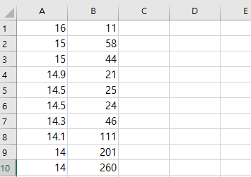

Stress Test
===
CSV 파일을 읽어 선형 회귀 모델을 학습하고, F 통계치를 계산.

Installation
===
* Python 3.6 설치 [URL](https://www.python.org/downloads/release/python-368/)

* 라이브러리 설치
```
명령 프롬프트 실행 후, 아래 명령어 입력.
>> python -m pip install numpy matplotlib argparse pathlib pandas
```

* 스크립트 다운로드
```
현재 화면 (혹은 아래 url 접속).
https://github.com/shjeon90/Stress-Test

우측 상단의 녹색 code 버튼 클릭 후, Download ZIP 버튼 클릭.

다운로드된 파일을 압축해제.
```

* 스크립트 실행
```
명령 프롬프트 싱행 후, 아래 명령어 입력.
>> python stress.py --fpath [CSV 파일 경로] -- conf [신뢰구간 크기. 90, 95, 혹은 99만 가능] -V

예시 (한글이나 공백문자 포함하는 경로):
>> python stress.py --fpath "C:\한글\공백 문자\data.csv" --conf 90 -V
```

Input format
===
fpath에 명시되는 CSV 데이터 파일은 반드시 아래와 같은 양식이어야 함.

